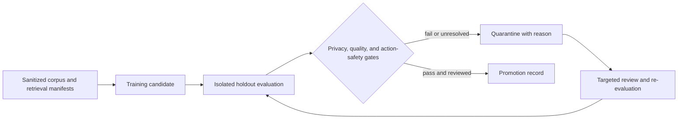

```mermaid
flowchart LR
    I["Sanitized corpus and retrieval manifests"] --> T["Training candidate"]
    T --> H["Isolated holdout evaluation"]
    H --> Q{"Privacy, quality, and action-safety gates"}
    Q -->|fail or unresolved| X["Quarantine with reason"]
    Q -->|pass and reviewed| P["Promotion record"]
    X --> R["Targeted review and re-evaluation"]
    R --> H
```
