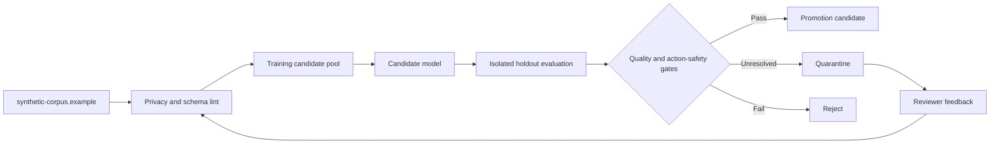

```mermaid
flowchart LR
  S["synthetic-corpus.example"] --> P["Privacy and schema lint"]
  P --> T["Training candidate pool"]
  T --> M["Candidate model"]
  M --> H["Isolated holdout evaluation"]
  H --> G{"Quality and action-safety gates"}
  G -->|Pass| C["Promotion candidate"]
  G -->|Unresolved| Q["Quarantine"]
  G -->|Fail| R["Reject"]
  Q --> F["Reviewer feedback"]
  F --> P
```
